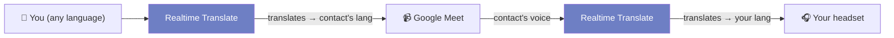
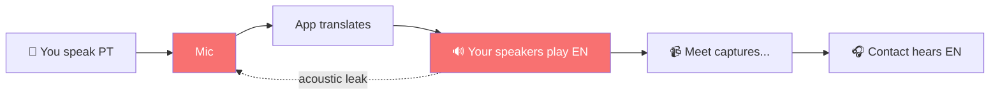
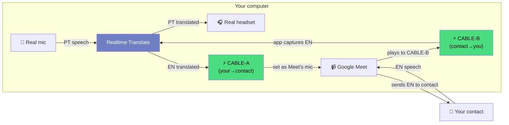
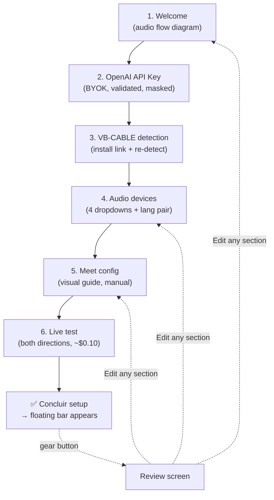
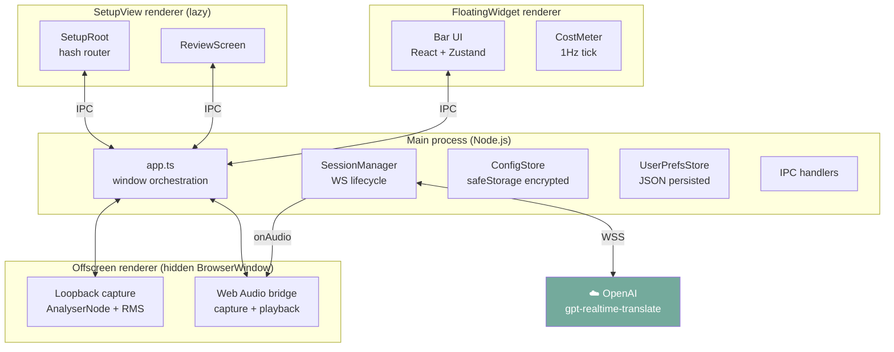
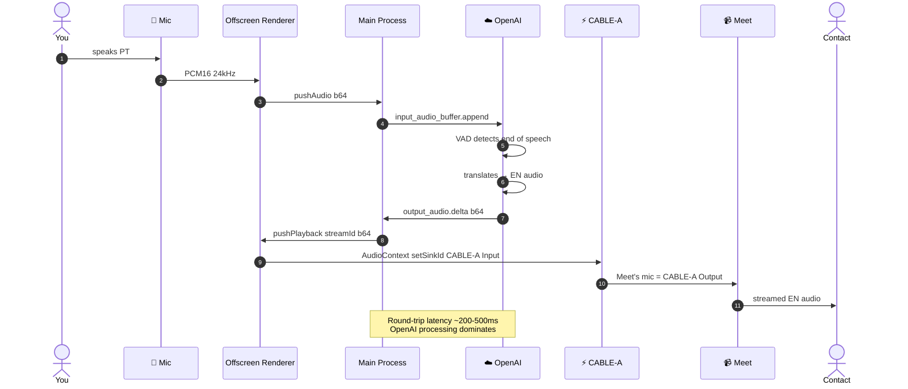
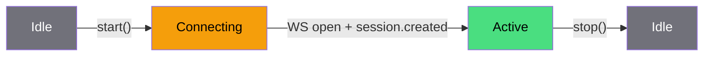
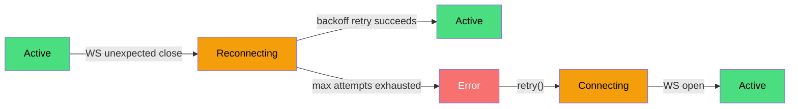
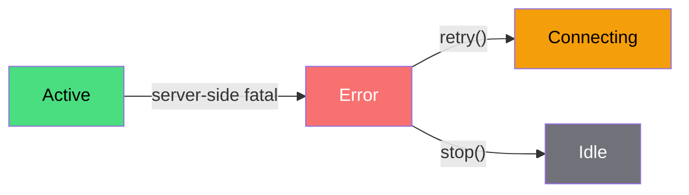

# Realtime Translate

> Real-time bidirectional voice translation between any pair of **72 supported languages** for Google Meet and other video-call apps. Bring your own OpenAI key.

[](LICENSE)
[](#roadmap)
[](#requirements)
[](src/shared/languages.ts)

You speak in your language, your contact hears theirs — in your voice, in their ear. They reply, you hear it translated. **No subtitles. No copy-paste. No second monitor.** Just a small floating bar that translates the call live.

The app sits between you and Meet (or Zoom, Teams, Discord — anything with a mic + speaker setting), captures voice on both sides, and pipes translated speech back through the call as if it came from the original speaker. Works between any two of 72 languages — the example below uses Portuguese ↔ English, but you pick the pair in the wizard.



---

## Table of contents

- [What it does](#what-it-does)
- [Why virtual cables (VB-CABLE A+B)](#why-virtual-cables-vb-cable-ab)
- [Requirements](#requirements)
- [Quick start (developers)](#quick-start-developers)
- [Setup wizard walkthrough](#setup-wizard-walkthrough)
- [Daily use](#daily-use)
- [Architecture](#architecture)
- [Audio routing in detail](#audio-routing-in-detail)
- [Privacy & security](#privacy--security)
- [Development](#development)
- [Cost](#cost)
- [Troubleshooting](#troubleshooting)
- [Roadmap](#roadmap)
- [Contributing](#contributing)
- [License](#license)
- [Credits](#credits)

---

## What it does

Realtime Translate is an Electron desktop app that:

1. **Listens** to your microphone (your voice, in your language).
2. **Sends** the audio to OpenAI's `gpt-realtime-translate` model via WebSocket.
3. **Receives** translated audio back, in the same speaker style, ~200-500ms later.
4. **Routes** the translated voice into your video call so your contact hears it as if you spoke their language.
5. **Reverses** the flow on the other side — captures your contact's voice, translates it, plays it in your headset.

**Languages supported:** 72 (model is Whisper-derived) — pick any pair as source/target in the wizard's Step 4. The translation engine is fully bidirectional and language-agnostic; nothing is hardcoded to PT/EN. The wizard's *UI* itself ships in two locales today (🇧🇷 Portuguese + 🇺🇸 English) with auto-detection from your OS — more UI locales are on the [roadmap](#roadmap).

**Designed for:** anyone who needs to talk to people in another language without learning it. Designers working with international clients. Recruiters interviewing across markets. Tech support to remote teams. Family calls across countries.

The visual UI is intentionally **discreet** — a small floating bar that lives in a corner of your screen. No giant dashboard. Inspired by Linear, Raycast, and Arc.

---

## Why virtual cables (VB-CABLE A+B)

This is the trickiest part of the setup, so it gets its own section. **You can't do realtime translation without virtual cables, and there's no way around it.** Here's why.

### The naïve approach (and why it doesn't work)

Imagine the simplest possible setup: the app reads your mic, translates, and plays the translated audio through your speakers. Meet picks up the speakers via its own audio routing. Done?



Two problems make this impossible:

1. **Acoustic feedback loop.** Your speakers play the translated voice → your mic picks it up → app translates again → speakers play again → infinite scream. Headphones don't fully solve it because Meet's "speakers" setting can't be disconnected from your physical sound device.
2. **Meet doesn't know which speaker is "translated."** Meet just hears whatever your physical mic picks up. So your contact would hear a chaotic mix of *your real voice + the translation* with the translation winning by a half-second delay. Unintelligible.

### The solution: virtual cables

A **virtual audio cable** is a software-only audio device that looks like a sound card to Windows but doesn't connect to any speakers or microphones. It's a digital wire: anything an app sends to its **input** side is instantly available on its **output** side.

We need **two** of these cables — call them **CABLE-A** and **CABLE-B** — because the app and Meet are passing audio in *both* directions and we don't want them to cross-talk:



**Two virtual cables, two independent paths, no acoustic feedback.** Your real mic only hears your voice. Your real headset only plays your contact's translated voice. Meet sees CABLE-A as its mic and CABLE-B as its speaker — it has no idea anything special is happening.

### Why two cables specifically (and not one)

If we used just one cable, the app's translated output going *to* Meet (your→contact direction) and Meet's audio going *to* the app (contact→you direction) would collide on the same wire. Each direction needs its own dedicated channel.

Think of it like a one-way street: CABLE-A is the lane heading from you toward your contact, CABLE-B is the lane coming back. They never overlap.

### Where to get VB-CABLE A+B

**VB-CABLE A+B** is a free donationware product from VB-Audio. The Setup wizard's Step 3 walks you through installing it and detecting both cables. Direct link: <https://vb-audio.com/Cable/index.htm#DownloadCableAB>

Note: the **basic VB-CABLE** (a single cable) is a separate product that doesn't work for bidirectional translation — you specifically need the A+B variant. The wizard checks for both and won't let you proceed if either is missing.

### What the wizard configures (and what you configure manually)

The app handles its own routing automatically once you pick the right devices in Step 4:

- App's **mic input** = your real microphone
- App's **translated-output destination** = CABLE-A's playback side
- App's **contact-audio source** = CABLE-B's recording side
- App's **headset output** = your real headset

The Meet side is **manual** because Meet is a webapp in your browser — we can't configure it for you. Step 5 of the wizard shows screenshots of Meet's settings panel where you'll select:

- Meet's **microphone** = `CABLE-A Output (VB-Audio Cable A)`
- Meet's **speakers** = `CABLE-B Input (VB-Audio Cable B)` — **not** the 16-channel variant

Step 6 runs a short live test (~$0.10 in OpenAI calls) to verify the chain works end-to-end. Note: the live test currently uses pre-recorded PT-BR and EN-US sample audio (Direction A: PT → EN, Direction B: EN → PT) regardless of your selected language pair, because the test WAVs are bundled. Other pairs work in production — they go through the same translation engine — they just don't have a quick built-in self-test. A multi-language test harness is on the roadmap.

---

## Requirements

| Category | Requirement |
|---|---|
| **OS** | Windows 10 or 11 (only Windows is supported today; macOS/Linux on roadmap) |
| **Hardware** | A microphone (any USB or built-in) and a way to hear audio (headset strongly recommended; speakers risk feedback) |
| **Software** | [VB-CABLE A+B](https://vb-audio.com/Cable/index.htm#DownloadCableAB) installed |
| **Account** | OpenAI API key with realtime API access — [platform.openai.com/api-keys](https://platform.openai.com/api-keys) |
| **Cost expectation** | ~$0.034 per session-minute per direction → ~$0.07/min for a typical bidirectional call → ~$2/hour |
| **Network** | Stable broadband, low latency to OpenAI's servers (same continent ideal) |

**For development only:**

| | |
|---|---|
| **Node.js** | 20 or newer |
| **Git** | Any recent version |

---

## Quick start (developers)

> An installable `.exe` is on the [roadmap](#roadmap) (M5). For now the app runs from source.

```bash
git clone https://github.com/<your-fork>/realtime-translate.git
cd realtime-translate
npm install
```

Install [VB-CABLE A+B](https://vb-audio.com/Cable/index.htm#DownloadCableAB) (the wizard will detect it). Reboot afterwards — Windows needs the restart to register the virtual cables.

```bash
npm run dev
```

The Setup wizard opens automatically on first launch:

1. Welcome screen
2. Paste your OpenAI key (saved encrypted via Electron's safeStorage; not committed to disk in plain text)
3. VB-CABLE detection
4. Pick your audio devices (the wizard pre-selects the right cables)
5. Configure Meet (manual — guided with screenshots)
6. Live test (~$0.10 of API calls)

After "Concluir setup", the floating bar appears in the bottom-right of your screen. That's your daily-use UI from then on.

---

## Setup wizard walkthrough

The wizard is a 6-step flow that hand-holds non-technical users from zero to working translation. Each step gates progression — you can't skip what isn't done.



Once setup is complete, clicking the **gear** on the floating bar opens the **Review screen** — a single page summarizing your config. Edit any section to jump straight back into that wizard step in **edit mode** (footer says "Salvar e voltar" instead of "Avançar").

---

## Daily use

After setup, the only UI is a small floating bar pinned to a corner of your screen.

| Element | What it does |
|---|---|
| ⚪ Orb | Idle (gray) / Connecting (yellow pulse) / Active (green) / Reconnecting (yellow flash) / Error (red) |
| Wave | Animated when audio is flowing |
| `pt ↔ en` | Current language pair. Click to open Settings. |
| Status text | Connection state when not idle/active |
| `120ms` | Latency tag (avg of both directions during active session) |
| `$0.07` | Live cost meter, refreshed every second during active translation |
| ▶ / ⏸ / ↻ | Start / Stop / Retry button (state-aware) |
| ⚙ | Open the Review screen |

Right-click the bar for the system menu (Settings / Quit).

The bar stays pinned across sessions — its position is remembered in your prefs file.

---

## Architecture

Realtime Translate is an Electron app split across **four processes / contexts**:



**Why four contexts?**

- **Main process** owns OS-level state (windows, IPC, encrypted storage, WebSocket sessions). Single source of truth.
- **Offscreen renderer** is a hidden BrowserWindow that does Web Audio API work — `getUserMedia`, `AudioContext`, `AnalyserNode`. Web Audio is renderer-only, so we run it in a background context that has no visible UI.
- **FloatingWidget** is the always-visible bar.
- **SetupView** is a lazy-loaded BrowserWindow opened on first launch or when the user clicks ⚙. Has its own React tree and uses hash-based routing (`#/wizard/N`, `#/review`) instead of pulling in a router lib.

The renderers never talk to each other directly — all coordination goes through main process IPC, with one exception: the dynamic `test:audio:${direction}` channel during the wizard's Step 6 live test, which fans translated audio chunks from main back to the SetupView for routing.

### Tech stack

| Layer | Tool |
|---|---|
| Shell | [Electron](https://www.electronjs.org/) |
| Bundler | [electron-vite](https://electron-vite.org/) |
| UI | [React 19](https://react.dev/) + [Zustand](https://github.com/pmndrs/zustand) |
| Language | [TypeScript](https://www.typescriptlang.org/) (strict + `exactOptionalPropertyTypes` + `noUncheckedIndexedAccess`) |
| WebSocket | [`ws`](https://github.com/websockets/ws) (main-process WebSocket client) |
| Tests | [Vitest](https://vitest.dev/) + [Playwright](https://playwright.dev/) (E2E spike) |
| Lint | [ESLint](https://eslint.org/) + [`@typescript-eslint`](https://typescript-eslint.io/) |
| i18n | Hand-rolled (template-literal-typed key lookup over JSON; ~150 keys × 2 locales) |

---

## Audio routing in detail

What actually happens during a single translation turn, from the moment you start speaking to the moment your contact hears the translation:



The mirror flow runs simultaneously in the other direction (your contact → CABLE-B → app → headset) on a second OpenAI session. The two sessions are independent — you can pause one without affecting the other, and a network blip on one side doesn't kill the other.

### Per-direction state machine

Each translation direction (A and B) tracks its own session state independently. The bar's aggregate state is the "max severity" of the two: **Active** wins over **Connecting**, **Error** wins over everything.

**Happy path (successful session lifecycle):**



**Reconnect path (transient network loss):**



**Fatal path (server rejected, e.g., bad API key):**



`stop()` works from any state and always returns to **Idle** (omitted from the diagrams above for readability).

---

## Privacy & security

- **Bring your own OpenAI key.** The app does not relay through any first-party server; your audio goes directly from your machine to OpenAI's WebSocket endpoint over TLS. No telemetry, no analytics, no remote logging.
- **Key storage.** Your OpenAI key is encrypted at rest using Electron's `safeStorage` API (Windows DPAPI under the hood). The encrypted blob lives at `%APPDATA%\realtime-translate\apikey.bin` — outside the project, outside the repo, machine-bound. Re-encrypted with your Windows credentials.
- **Local-only state.** Preferences, language pair, device selection, and UI locale all live in `%APPDATA%\realtime-translate\prefs.json`. Plain JSON; nothing sensitive in it.
- **No conversation logs.** The app does not record, store, or upload your conversations. Audio chunks are streamed to OpenAI in real time and are not persisted on disk.
- **No automatic updates.** Updates ship via Git pull (developers) until M5 lands a signed installer with code-signing.

---

## Development

### Layout

```
src/
  main/                 # Main process (Node.js)
    app.ts              # Window orchestration, IPC wiring
    audio/              # Device detection, loopback capture
    config/             # ConfigStore (safeStorage), UserPrefsStore (JSON)
    ipc/                # IpcInvokeMap, registerIpcHandlers
    translate/          # OpenAISession, SessionManager, TestSessionRegistry
    preload.ts          # Renderer-bound API surface
  renderer/
    components/         # Reusable UI atoms (Orb, Waveform, ActionButton, ...)
    state/              # Zustand stores
    views/
      FloatingWidget.tsx
      setup/
        SetupRoot.tsx
        wizard/         # Step1Welcome..Step6TestTranslation, WizardShell
        review/         # ReviewScreen, ReviewSection
        shared/         # useHashRoute, MeetGuide
    offscreen/          # Web Audio bridge (background renderer)
    styles/             # tokens.css, widget.css, setup.css
  shared/               # Code shared across processes
    i18n/               # I18nProvider, locales (pt-BR, en-US)
    types.ts            # SessionState, DeviceInventory, ...
    languages.ts        # 72-language list
    events.ts           # IPC channel constants
tests/
  unit/                 # Vitest, node-only (no jsdom)
docs/
  superpowers/specs/    # Design specs
  superpowers/plans/    # Implementation plans
  QA-CHECKLIST.md       # Manual smoke procedures per milestone
assets/
  setup/                # Meet config screenshots (jpg)
  test/                 # SAPI-generated WAVs for the live test
```

### Scripts

| Command | What |
|---|---|
| `npm run dev` | Start the app in dev mode (hot reload via electron-vite) |
| `npm run build` | Production build (3 HTML entries: floating-widget, setup-view, offscreen) |
| `npm run typecheck` | Run TypeScript on both main + renderer configs |
| `npm run lint` | ESLint everything |
| `npm test` / `npm run test:watch` | Vitest |
| `npm run test:e2e` | Playwright E2E (M3 spike) |
| `npm run format` | Prettier |

### Tests

Tests are vitest **node-only** — no jsdom, no React rendering. We test pure functions, IPC bridges, and core logic. UI tests are deferred until we add a JSDOM/happy-dom environment.

Current coverage at v0.4.0-m4: 100 local tests, all passing. Test files focus on:

- `computeCost` (pure function, 5 cases)
- `parseHashRoute` (regex parser, 5 cases)
- `i18n` (createT, lookup fallback, locale resolution)
- `OpenAISession` (state transitions, reconnect backoff, audio buffer overflow)
- `SessionManager` (bidirectional lifecycle, partial-failure cleanup)
- `deviceDetector` (cable matching with regex variants)
- `loopbackCapture` (offscreen bridge)

### Strict TypeScript notes

The project uses three flags that catch a lot of bugs early but force specific patterns:

- **`exactOptionalPropertyTypes: true`** — `mode?: 'edit'` rejects `mode={undefined}`. Always type optional props as `mode?: 'edit' | undefined` if a caller might pass `undefined` explicitly.
- **`noUncheckedIndexedAccess: true`** — `arr[i]` returns `T | undefined`. Always guard or `?? fallback`.
- **`strict: true`** — standard set.

---

## Cost

OpenAI charges roughly **$0.034 per session-minute per direction**. A typical bidirectional call:

| Scenario | Cost |
|---|---|
| 1-minute bidirectional check | ~$0.07 |
| 30-minute meeting | ~$2.04 |
| 1-hour interview | ~$4.08 |
| Wizard's Step 6 live test | ~$0.10 (two short ~3s sessions) |

The floating bar shows a **live cost meter** during active translation — the dimmed `$0.07` tag refreshes every second so you can see the meter ticking.

This is **the user's OpenAI bill**, not the app's. The app does not collect any payment, take any cut, or have visibility into your spend beyond what's displayed locally.

---

## Troubleshooting

| Symptom | Likely cause | Fix |
|---|---|---|
| Wizard's Step 3 says "VB-CABLE not detected" after install | Windows didn't reload the audio driver list | Reboot, then click "Já instalei, re-detectar" |
| Step 4's "Saída pro Meet" dropdown doesn't show CABLE-A | Auto-detect skipped because saved prefs already had a different value | Open the dropdown manually and pick `CABLE-A Input (VB-Audio Cable A) (recomendado)` from the top |
| Step 6 Direction A: "Áudio foi roteado mas não voltou pelo CABLE-A" | `selectedToMeet` doesn't actually point at CABLE-A | Go back to Step 4 and re-pick CABLE-A; or check VB-CABLE driver health in Windows Sound settings |
| Step 6 Direction A: "OpenAI não retornou áudio traduzido" | API key invalid, quota exhausted, or source language doesn't match the WAV | Check key + billing on platform.openai.com |
| Bar stuck on "Conectando..." | Network issue or invalid key | Right-click → Settings → Edit API key |
| Translation choppy / gaps | Network instability or CPU saturation | Check connection; close heavy apps |
| Meet doesn't see CABLE-A as a mic option | Meet was opened before VB-CABLE finished loading | Refresh the Meet tab |

For deeper debugging, open DevTools on the floating widget or setup view (View menu → Toggle Developer Tools).

---

## Roadmap

| Milestone | Status | Highlights |
|---|---|---|
| **M1** v0.1.0 | ✅ shipped | Core translation engine, single-direction PT↔EN, offscreen Web Audio, OpenAI session, encrypted key storage |
| **M2** v0.2.0 | ✅ shipped | Bidirectional translation, dual sessions, language picker, device manager |
| **M3** v0.3.0 | ✅ shipped | FloatingWidget bar UI, prefs persistence, three HTML entry points, Playwright E2E spike |
| **M4** v0.4.0 | ✅ shipped (this version) | SetupView wizard (6 steps + review), bilingual UI (PT/EN), live cost dashboard, Test Translation backend, Meet config visual guide |
| **M5** | 🔜 next | **Signed `.exe` installer** (electron-builder + code signing), auto-update, `shell.openExternal` for external links, custom modal replacing `window.confirm`, persist `meetConfirmed` across nav, extract `<SetupTitlebar />`, click-through on bar margins |
| **M6+** | future | macOS support, more UI languages (engine already supports 72), session transcript export, global keyboard shortcuts |

---

## Contributing

The project is single-developer at the moment but contributions are welcome.

- **Branching:** work on a feature branch off `main`. PRs go to `main`.
- **Commits:** descriptive subject + body. The repo uses `Co-Authored-By: Claude Opus 4.7 <noreply@anthropic.com>` for AI-pair-programmed commits.
- **Tests:** new pure functions get unit tests. UI changes don't require tests until we land jsdom/happy-dom.
- **TypeScript:** all flags must keep passing — see [Strict TypeScript notes](#strict-typescript-notes).
- **i18n:** new user-visible strings go in **both** `pt-BR.json` and `en-US.json` in the same change. The TypeScript template-literal type catches missing keys at compile time.
- **CSS:** prefer tokens (`var(--accent)`) over raw colors. Match the existing premium-discreet design language (Linear / Raycast / Arc).

---

## License

[MIT](LICENSE) — do whatever, just keep the notice.

---

## Credits

- **OpenAI** — the `gpt-realtime-translate` model that does the actual translation.
- **VB-Audio** — [VB-CABLE A+B](https://vb-audio.com/Cable/index.htm), the donationware virtual cable software that makes the routing possible.
- **Google** — Meet, the primary target app.
- **Linear / Raycast / Arc** — design language inspiration.
- **Electron, React, Zustand, Vite, Vitest, ESLint, TypeScript** — the open-source stack this is built on.

Built with ☕ in Brazil.
